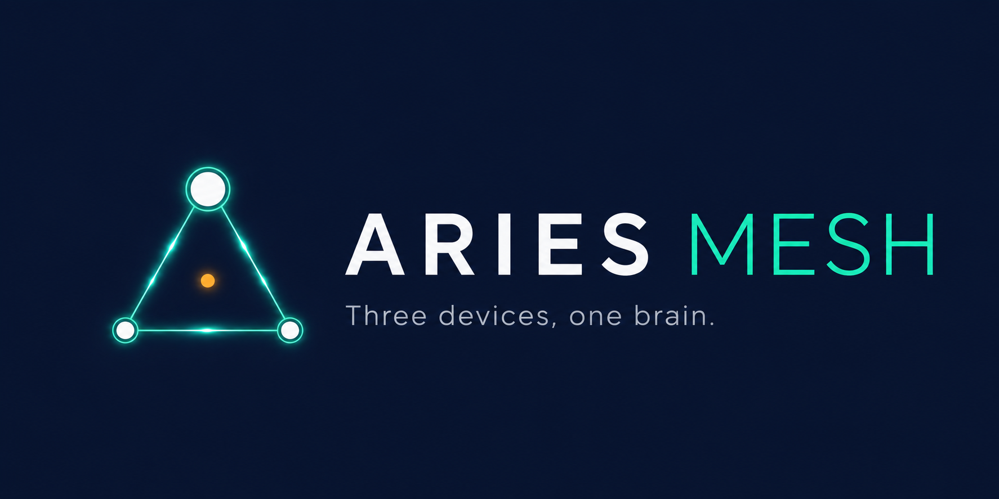

<p align="center">
  
</p>

<p align="center">
  <strong>Open-source personal compute fabric — intelligent task routing, shared memory, and cryptographic identity across your device mesh.</strong>
</p>

<p align="center">
  
  
  
  
</p>

---

## What is Aries Mesh

Aries Mesh turns your personal devices — laptop, desktop, phone — into a single coordinated runtime for AI agents. It provides intelligent task routing (send each task to the best device based on privacy, cost, capability, and health), a shared memory fabric (every agent on every device reads and writes from the same CRDT-backed context store), and user-owned cryptographic identity (you hold the root key, not any vendor).

It sits beneath agent frameworks and model providers as the infrastructure layer. It doesn't care whether you use Claude, GPT, Gemini, Llama, or Qwen. It treats all of them as pluggable adapters and focuses on the orchestration: how devices discover each other, how tasks get routed, how context flows, and who controls the keys.

---

## What works today

**Identity & trust**
- Household initialization with Shamir 2-of-3 root key splitting and Ed25519 device keys
- Device pairing via 6-word BIP39 codes over mDNS, gated by a UCAN membership token
- UCAN 1.0 capability tokens with delegation chains and `/*` glob attenuation
- Revocation list propagated to every peer — one device can disable a compromised sibling in seconds
- Key files encrypted at rest with Argon2id-derived keys + XSalsa20-Poly1305 SecretBox (optional passphrase)

**Encrypted transport**
- Every byte between nodes flows through a Noise_XX session (X25519 ECDH + ChaCha20-Poly1305 AEAD, per-session ephemeral forward secrecy)
- CBOR-framed `AriesMessage` envelopes over TCP, mDNS peer discovery via zeroconf
- Signed Continuation envelopes for cross-device task hand-off
- Hash-linked Ed25519-signed receipt chains for audit trails

**Scheduling**
- Four-stage router: Filter → Mandate → Score → Select across five weighted dimensions (privacy 3.0, capability 2.0, latency 1.5, cost 1.0, health 1.0)
- User-defined mandates (tag-based, time-based, default) via `~/.aries/mandates.yaml`
- Live `DeviceProfiler` snapshots (CPU, RAM, battery, thermal, network) feeding the health dimension

**Shared memory**
- CRDT-backed store: LWW-Register with Lamport clocks + DID tie-break, deduplicated append-only logs
- Three namespaces with TTLs: `aries:context://` (24 h), `aries:memory://` (no expiry), `aries:cache://` (1 h)
- Two-phase sync across the encrypted transport (100 ms debounce + 30 s periodic)
- UCAN-scoped write ACL: an agent with `aries:context://tasks/abc/*` cannot touch a sibling task's keys

**Distributed inference (Feature 2)**
- llama.cpp RPC orchestration: scheduler scores "local 7B" / "distributed 70B across two devices" / "cloud Claude" against each other
- Capability probe finds local llama-server / rpc-server binaries, GGUF files, GPU backend (Metal / CUDA / Vulkan / CPU)
- `InferenceCoordinator` brings rpc-server workers up over the encrypted transport, streams tokens via httpx
- Adapters: `LiteLLMAdapter` (100+ providers) + `MockAdapter` for offline tests/demos

**Streaming + UX**
- `aries invoke -m "..." --stream` prints tokens as they arrive
- `aries start` launches a Rich-Live terminal dashboard (peers, agents, memory, inference, activity)
- Web dashboard at `http://localhost:7272` — React + Tailwind, served by an aiohttp server bundled in the daemon. SSE stream for live events.

**CLI**
- `init`, `start`, `connect`, `pair`, `register`, `agents`, `invoke`, `handoff`, `resume`, `status`, `memory`, `household`, `mandate`, `inference {status,run,benchmark}`
- `aries connect <ip:port>` is the mDNS-free fallback used on Termux and other environments where `zeroconf` isn't available

**Distribution**
- Standalone binaries for Linux / macOS (Apple Silicon) / Windows via PyInstaller — one-line install (`curl | sh` or `irm | iex`), no Python required
- React dashboard is bundled inside the wheel + binary; end users never run `npm`

**Quality**
- 82 tests passing — identity, memory, scheduler, adapters, two-node integration, security, encrypted transport, distributed inference, streaming, dashboard, ACL, API
- Zero external API keys required to run the suite

---

## Architecture

```
┌──────────────────────┐    ┌──────────────────────┐    ┌──────────────────────┐
│   MacBook Pro        │    │   Linux Desktop      │    │   Android (Termux)   │
│ ─────────────────    │    │ ─────────────────    │    │ ─────────────────    │
│  CLI · TUI · Web UI  │    │  CLI · TUI · Web UI  │    │  CLI · TUI · Web UI  │
│  ─ aiohttp :7272 ─   │    │  ─ aiohttp :7272 ─   │    │  ─ aiohttp :7272 ─   │
│  ┌────────────────┐  │    │  ┌────────────────┐  │    │  ┌────────────────┐  │
│  │ Shared Memory  │  │    │  │ Shared Memory  │  │    │  │ Shared Memory  │  │
│  │ CRDT · ACL     │  │    │  │ CRDT · ACL     │  │    │  │ CRDT · ACL     │  │
│  ├────────────────┤  │    │  ├────────────────┤  │    │  ├────────────────┤  │
│  │  Scheduler +   │  │    │  │  Scheduler +   │  │    │  │  Scheduler +   │  │
│  │  Inference Reg │  │    │  │  Inference Reg │  │    │  │  Inference Reg │  │
│  ├────────────────┤  │    │  ├────────────────┤  │    │  ├────────────────┤  │
│  │  Transport +   │  │    │  │  Transport +   │  │    │  │  Transport +   │  │
│  │  Identity      │  │    │  │  Identity      │  │    │  │  Identity      │  │
│  ├────────────────┤  │    │  ├────────────────┤  │    │  ├────────────────┤  │
│  │  Node Runtime  │  │    │  │  Node Runtime  │  │    │  │  Node Runtime  │  │
│  │  + Adapters    │  │    │  │  + Adapters    │  │    │  │  + Adapters    │  │
│  └────────────────┘  │    │  └────────────────┘  │    │  └────────────────┘  │
└──────────┬───────────┘    └──────────┬───────────┘    └──────────┬───────────┘
           │     Noise_XX-encrypted CBOR over TCP · mDNS discovery │
           └───────────────────────────────────────────────────────┘
```

Every device runs the same daemon. The scheduler decides where each task goes. Memory syncs automatically. All inter-device traffic is encrypted at the session level — a packet capture on the LAN sees ciphertext only.

| Layer | Responsibility | Key Modules |
|-------|---------------|-------------|
| Surfaces | CLI (`aries …`), Rich-Live terminal dashboard, React web dashboard on `http://localhost:7272` | `cli/main.py`, `cli/dashboard.py`, `api/server.py`, `dashboard/` |
| Layer 3 — Shared Memory | CRDT (LWW + AppendLog), three namespaces, two-phase sync, UCAN-scoped write ACL | `memory/store.py`, `memory/sync.py` |
| Layer 2 — Scheduler + Inference | 4-stage router (Filter→Mandate→Score→Select), distributed-inference registry + coordinator | `scheduler/router.py`, `scheduler/profile.py`, `inference/` |
| Layer 1 — Transport + Identity | Noise_XX-encrypted CBOR transport, mDNS discovery, Ed25519 + Shamir + UCAN delegation chains | `transport/`, `identity/` |
| Layer 0 — Node Runtime | Per-device daemon orchestrating all layers, vendor adapters (`LiteLLMAdapter` / `MockAdapter`), hardware profiler | `node.py`, `adapters/` |

---

## Install

### macOS / Linux

```bash
curl -fsSL https://raw.githubusercontent.com/aries-mesh/ariesmesh/main/install.sh | bash
```

Downloads the prebuilt binary for your architecture (x86_64 or ARM64) and installs it to `/usr/local/bin/aries` — falls back to `~/.local/bin` if that isn't writable.

### Windows (PowerShell)

```powershell
irm https://raw.githubusercontent.com/aries-mesh/ariesmesh/main/install.ps1 | iex
```

Drops `aries.exe` under `%LOCALAPPDATA%\aries\` and adds it to your user PATH.

### Android (Termux)

```bash
curl -fsSL https://raw.githubusercontent.com/aries-mesh/ariesmesh/main/install.sh | bash
```

Automatically detected — the universal script hands off to `install-termux.sh`, which simply runs `pkg install python git` and `pip install git+…`. The core package is pure-Python plus PyNaCl (which has ARM wheels on PyPI), so no native compilation is needed. Heavy extras (`zeroconf`, `litellm`, `psutil`, `aiohttp`, `blake3`) are skipped and the daemon detects their absence at runtime:

| Capability | Termux | Why |
|---|---|---|
| Encrypted Noise transport | ✓ | PyNaCl ARM wheel |
| Shared memory + CRDT sync | ✓ | pure Python |
| Signed continuations / receipts | ✓ | pure Python |
| Terminal dashboard | ✓ | Rich is pure Python |
| Routes tasks to peers | ✓ | only sends INVOKE messages |
| Manual peer add via `aries connect` | ✓ | mDNS-free fallback |
| mDNS auto-discovery | — | `zeroconf` skipped → use `aries connect` |
| Web dashboard at `:7272` | — | `aiohttp` skipped |
| Local LLM inference (Ollama / cloud) | — | `litellm` skipped → routes to peers |
| Hardware profiling (CPU / battery) | — | `psutil` skipped → safe defaults |
| BLAKE3 hashing | — | falls back to SHA-256 |

After install, point your phone at your desktop's IP:port in one command:

```bash
aries init --name my-phone
aries connect 192.168.1.42:47291    # starts daemon + adds your laptop as a peer
```

### From PyPI (any platform, lighter than the binary)

```bash
pip install aries-mesh[full]        # desktop — all features
pip install aries-mesh              # minimal — same as Termux flow
```

The `[full]` extra adds `zeroconf`, `litellm`, `psutil`, `aiohttp`, `blake3`, `websockets`, and `uvloop` (the last only on non-Windows). Without it you get the lightweight Termux-style install with the same graceful-degradation behavior.

### From source (contributors)

```bash
git clone https://github.com/aries-mesh/ariesmesh.git
cd ariesmesh
python -m venv .venv
source .venv/bin/activate  # Windows: .venv\Scripts\Activate.ps1
pip install -e ".[dev]"
pytest -q                  # 82 tests passing
```

To rebuild the web dashboard:

```bash
cd dashboard
npm install
npm run build              # outputs to src/aries/dashboard/dist/
```

No Python, no pip, no npm needed when installing from the prebuilt binary — the dashboard is bundled inside. Open `http://localhost:7272` after `aries start`.

---

## Quickstart

### Initialize and start

```bash
aries init --name my-laptop
aries register --vendor ollama --model qwen2.5:7b
aries register --vendor mock --model fallback
aries start
```

In a second terminal:

```bash
aries status
aries agents
```

### Pair a second device

On the first device:

```bash
aries pair --invite
# prints: Pairing code: alpha anchor apple arrow seed shore
```

On the second device:

```bash
aries init --name my-phone
aries pair --code "alpha anchor apple arrow seed shore"
```

**On Termux (or anywhere without mDNS):** skip `aries pair` and connect directly by IP. The first device prints its host:port in the terminal dashboard.

```bash
aries init --name my-phone
aries connect 192.168.1.42:47291
```

### Hand off a conversation

```bash
# On device A — start a task
aries invoke -m "Explain the CAP theorem" --capability text.qa

# Hand it off to device B
aries handoff --task-id <task_id> --target <device_B_did> --reason user_request
```

The conversation continues on device B with full context. Shared memory keeps both devices in sync.

---

## How task routing works

When a task arrives, the scheduler runs a four-stage pipeline. First, Filter removes agents that lack the required capability. Second, Mandate applies your standing policies (tag-based, time-based, or default rules from `~/.aries/mandates.yaml`). Third, Score ranks remaining candidates across five weighted dimensions. Fourth, Select picks the winner.

| Dimension | Weight | What it means |
|-----------|--------|----------------|
| Privacy | 3.0 | Local models strongly preferred over cloud |
| Capability | 2.0 | Larger context windows, stronger models score higher |
| Latency | 1.5 | LAN and local agents favored |
| Cost | 1.0 | Free beats metered beats paid |
| Health | 1.0 | Battery, thermal, CPU load factor in |

Local models win by default. Override with mandates.

```yaml
# ~/.aries/mandates.yaml
- name: sensitive-stays-local
  when_tags: [medical, financial, personal]
  enforce_locality: local

- name: overnight-budget
  when_time: "00:00-06:00"
  enforce_cost_class: free
```

---

## Project structure

```
aries-mesh/
├── src/aries/
│   ├── node.py                    # Per-device daemon — ties all layers together
│   ├── continuation.py            # Signed hand-off envelope
│   ├── receipt.py                 # Hash-linked signed audit chain
│   ├── identity/
│   │   ├── keys.py                # Ed25519 keypairs, Shamir 2-of-3, Argon2id storage
│   │   ├── did.py                 # did:key encoding/decoding
│   │   ├── ucan.py                # UCAN 1.0 tokens, chain validation, glob attenuation
│   │   └── household.py           # Household state, pairing, agent registration
│   ├── transport/
│   │   ├── peer.py                # CBOR wire protocol, TCP connections
│   │   ├── crypto.py              # Noise_XX handshake + AEAD session
│   │   └── discovery.py           # mDNS service advertisement and browsing
│   ├── scheduler/
│   │   ├── router.py              # Four-stage routing pipeline, mandates
│   │   └── profile.py             # Hardware profiler (psutil)
│   ├── memory/
│   │   ├── store.py               # LWW-Register + AppendLog CRDTs, three namespaces, UCAN ACL
│   │   └── sync.py                # Two-phase sync protocol
│   ├── inference/
│   │   ├── registry.py            # Catalog of feasible inference configs (local/distributed/cloud)
│   │   ├── capability.py          # Probe llama.cpp binaries, GGUF files, GPU backend
│   │   ├── coordinator.py         # Lifecycle of a distributed-inference session
│   │   └── streaming.py           # llama-server SSE → STREAM_CHUNK forwarder
│   ├── adapters/
│   │   ├── base.py                # Abstract adapter interface
│   │   ├── litellm_adapter.py     # Universal LLM adapter (100+ providers)
│   │   └── mock_adapter.py        # Deterministic offline adapter for testing
│   ├── api/
│   │   └── server.py              # aiohttp JSON + SSE API for the web dashboard
│   ├── dashboard/
│   │   └── dist/                  # Bundled React build (committed; served by api/server.py)
│   └── cli/
│       ├── main.py                # CLI entry point
│       └── dashboard.py           # Rich-Live terminal dashboard
├── dashboard/                     # React + Tailwind source (devs only)
│   ├── src/                       # main.jsx, App.jsx, pages/, components/, hooks/
│   └── vite.config.js
├── tests/                         # 82 tests (unit + integration + security + API)
├── docs/
│   ├── ARCHITECTURE.md
│   ├── ENGINEERING_SPEC.md
│   ├── DEVELOPER_GUIDE.md
│   ├── TECH_STACK.md
│   ├── THREAT_MODEL.md
│   └── research/
│       └── distributed-inference-survey.md
├── .github/workflows/
│   ├── ci.yml                     # pytest + ruff on every push/PR
│   └── release.yml                # PyInstaller binary build on v* tags
├── install.sh                     # Universal POSIX installer (redirects to install-termux.sh on Android)
├── install-termux.sh              # Termux-only minimal pip install (no native deps)
├── install.ps1                    # Windows PowerShell installer
└── pyproject.toml
```

---

## Tech stack

| Component | Choice | Purpose |
|-----------|--------|---------|
| Language | Python 3.11+ | Native async/await, modern type system |
| Cryptography | PyNaCl (libsodium) | Ed25519 signing, Argon2id KDF, SecretBox encryption |
| Wire format | cbor2 | Compact binary encoding, deterministic for signatures |
| Discovery | zeroconf | mDNS service advertisement and peer browsing |
| LLM adapters | litellm | Universal translation layer for 100+ providers |
| Profiling | psutil | Cross-platform CPU, RAM, battery, thermal monitoring |
| Content hashing | BLAKE3 | Fast cryptographic hashing with SHA-256 fallback |
| CLI | Click + Rich | Command framework with formatted terminal output |
| Mandates | PyYAML | Human-readable policy configuration |

---

## Documentation

- [Architecture](docs/ARCHITECTURE.md)
- [Engineering Specification](docs/ENGINEERING_SPEC.md)
- [Developer Guide](docs/DEVELOPER_GUIDE.md)
- [Tech Stack & Test Inventory](docs/TECH_STACK.md)
- [Threat Model](docs/THREAT_MODEL.md)
- [Security Policy](SECURITY.md)
- [Distributed Inference Research Survey](docs/research/distributed-inference-survey.md)

---

## Contributing

See [CONTRIBUTING.md](CONTRIBUTING.md) for guidelines. Run `pip install -e '.[dev]'` then `pytest` to verify all 82 tests pass. Open an issue before sending a PR.

---

## License

MIT — see [LICENSE](LICENSE).

---

<p align="center"><sub>Three devices, one brain.</sub></p>
